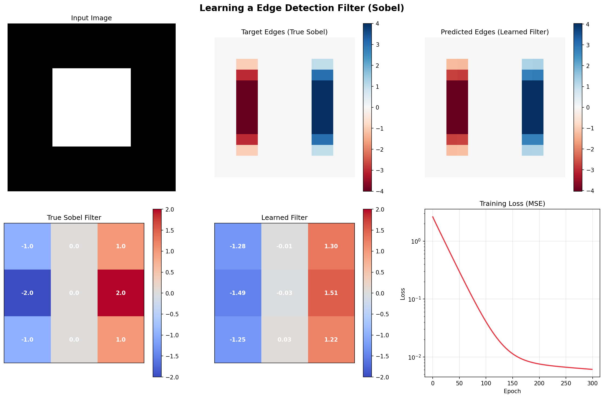
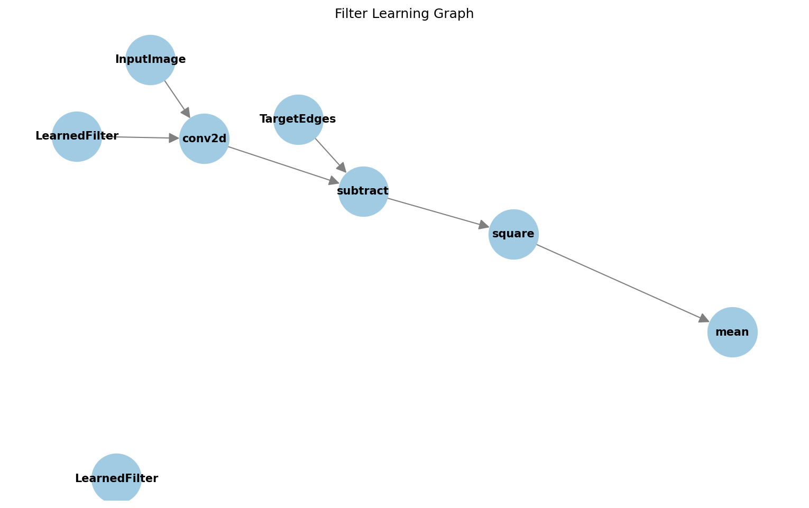
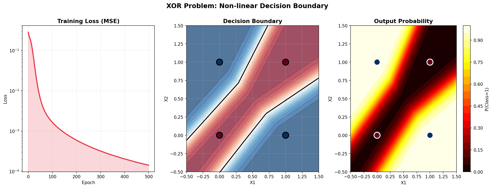
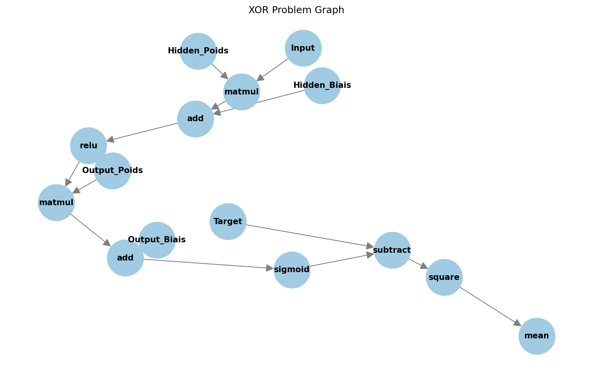
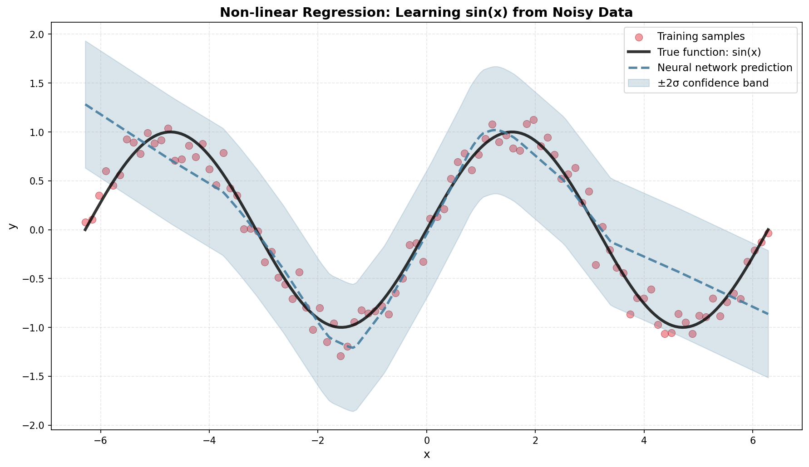
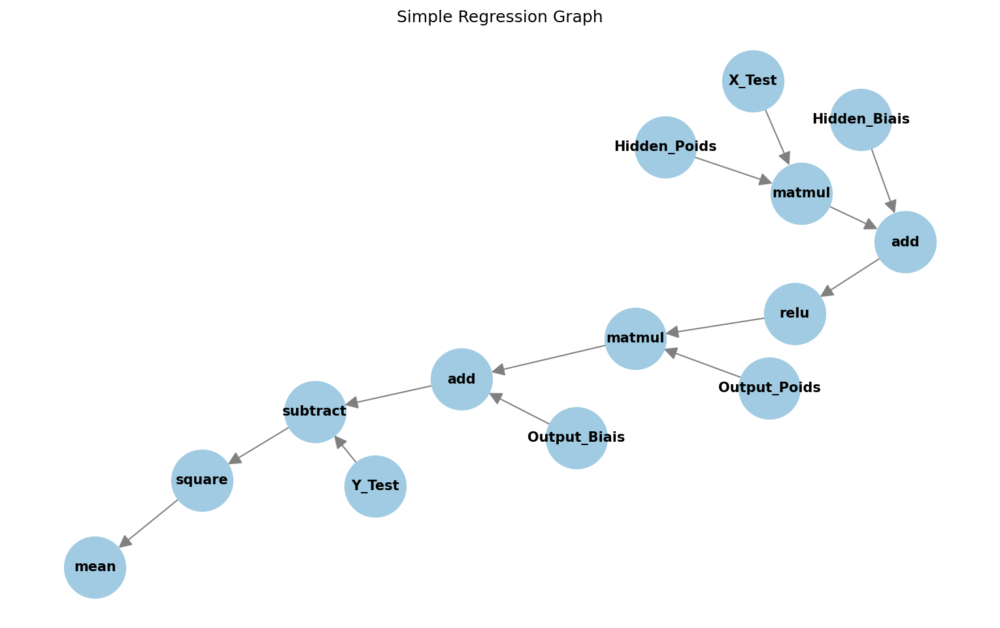
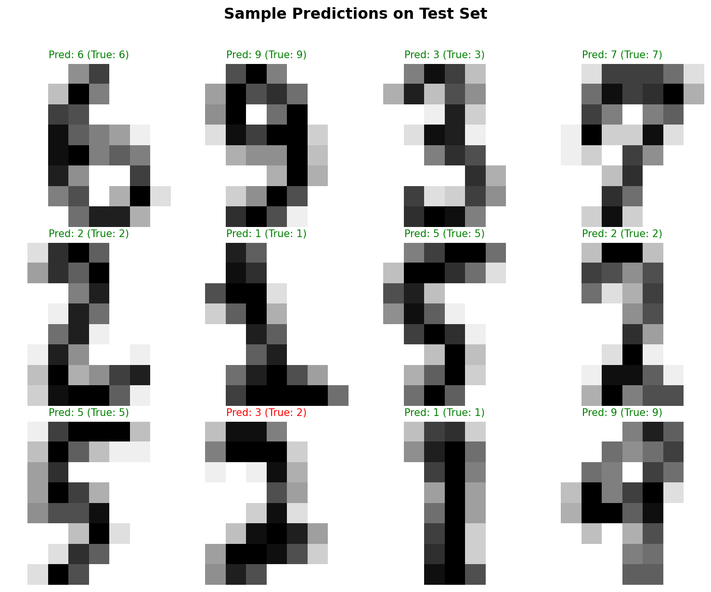
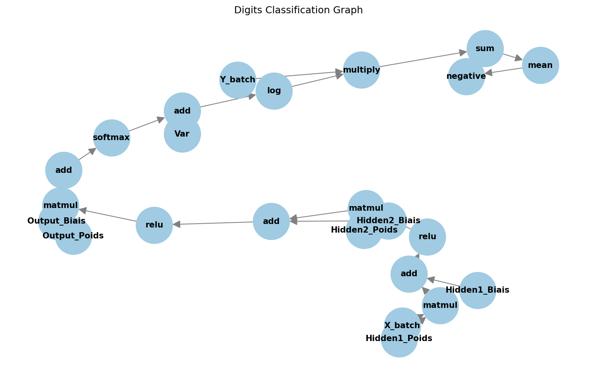

# DifferentialNumpy (dnp)

**DifferentialNumpy** (`dnp`) is a lightweight, educational automatic differentiation engine and neural network library built entirely on top of NumPy (with SciPy utilized for specific operations like convolution). Inspired heavily by PyTorch, it provides a dynamic computation graph, robust backpropagation mechanisms, and a full suite of neural network components to train machine learning models from scratch.

## 🚀 Key Features

* **Dynamic Computation Graph:** Tracks operations on tensors and constructs exact gradients dynamically using Vector-Jacobian Products (VJPs) under the hood.
* **Automatic Differentiation Engine (`dnp.autograd`):** Complete execution context management using sessions to build computation graphs efficiently.
* **Versatile Neural Network Library (`dnp.layers`):**
  * Core Modules: `Linear`, `Sequential`, `Flatten`, `Module`
  * Convolution & Pooling: `Conv2d`, `MaxPool2d`, `AvgPool2d`
  * Normalization: `BatchNorm1d`, `BatchNorm2d`
  * Attention Mechanisms: `ScaledDotProductAttention`, `SelfAttention`, `MultiHeadAttention`
  * Regularization: `Dropout`
* **Non-linear Activations:** `ReLU`, `Sigmoid`, `Tanh`, `Softmax`
* **Optimizers (`dnp.core.optimizers`):** Extensive range of optimizers including `SGD`, `Momentum`, `RMSprop`, `Adagrad`, `Adam`, and `AdamW`.

## 📂 Project Structure

```text
DifferentialNumpy/
├── dnp/
│   ├── autograd/      # Computation graph, engine sessions, and backpropagation utilities
│   ├── core/          # Core abstractions (layer bases, optimizers, ops setup)
│   ├── layers/        # High-level neural network modules and operations
│   ├── ops/           # Deep numpy mathematical operations mapping and their VJP rules
│   ├── test/          # Robust unit test suites (`pytest` compatible)
│   └── utils/         # Developer tools, decorators, and basic utility functions
├── examples/          # Executable end-to-end Python scripts demonstrating real-world tasks
├── notebooks/         # Jupyter notebooks covering demonstrations, math rules, and tutorials
└── figures/           # Outputs generated by the `/examples` experiments (loss curves, boundaries)
```

## 🧠 Getting Started

Building sophisticated machine learning algorithms is seamless. Here is an example defining a small multi-layer perceptron (MLP) trained on synthetic data:

```python
import numpy as np
import dnp
from dnp.layers import Sequential, Linear, ReLU
from dnp.core.optimizers import Adam

# 1. Define Model Architecture
model = Sequential(
    Linear(in_features=10, out_features=32),
    ReLU(),
    Linear(in_features=32, out_features=2)
)

# 2. Configure Optimizer
optimizer = Adam(model.parameters(), lr=0.01)

# Create some synthetic data wrappers
X = dnp.array(np.random.randn(5, 10))
Y_true = dnp.array(np.random.randn(5, 2))

# 3. Training Loop
for epoch in range(100):
    # Establish a tracking session for this forward pass 
    with dnp.autograd.session.SessionGraph() as session:
        # Forward pass
        predictions = model(X)
        
        # Calculate Mean Squared Error loss 
        # Note: Math operators (+, -, *, /) directly interface with the computation graph!
        loss = dnp.sum((predictions - Y_true) ** 2) / 5
        
        # Backward pass (compute gradients)
        loss.backward()
        
        # Apply gradients to weights
        optimizer.step()
        
        # Zero gradients for the next epoch iteration
        optimizer.zero_grad()
    
    if epoch % 10 == 0:
        print(f"Epoch {epoch} | Loss: {loss.data:.4f}")
```

## 🛠️ Examples & Demonstrations

The `examples/` directory contains thoroughly documented, executable Python examples displaying the capabilities of DifferentialNumpy:

1. **Learning a Convolution Filter** (`example_1_filter_learning`): Training an empty filter using backpropagation to automatically replicate the behavior of a Sobel edge-detection filter.
   
   
   

2. **The XOR Problem** (`example_2_xor_problem`): Cracking the classic non-linear XOR problem using MLP layers and non-linear properties.
   
   
   

3. **Simple Regression** (`example_3_simple_regression`): Approximating polynomial logic with deep networks to model a sine wave with noisy target points.
   
   
   

4. **Digit Classifications** (`example_4_digits_classification`): Using `scikit-learn` digits data and multi-class Cross Entropy loss for real-world image classification.
   
   
   

To run an example, execute the respective file from the project root:
```bash
python examples/example_2_xor_problem/xor_problem.py
```

## ⚙️ Installation & Requirements

Ensure you are running Python 3.8+ and install the native computing and charting dependencies. 
DifferentialNumpy is now packaged using `Poetry`, providing a reproducible environment.

```bash
# 1. Install Poetry if you haven't already
curl -sSL https://install.python-poetry.org | python3 -

# 2. Install dependencies via Poetry
poetry install

# 3. Enter the environment
poetry shell
```

If you prefer `pip`:
```bash
pip install numpy scipy matplotlib pytest networkx
```

Execute tests using `pytest` inside the root or `/dnp/test` directory to ensure functionality of the autograd engine computations:
```bash
pytest dnp/test/
```

## 🎓 Educational Focus: Understanding Automatic Differentiation

We strongly believe in learning by doing. The core of any backpropagation engine relies on Vector-Jacobian Products (VJPs) to correctly route derivatives dynamically.

To fully understand the mathematical foundation of operators (like matrix multiplication, convolution, broadcasting) constructed in this project, we have included an extensive guide.

> [!TIP]
> **Read the VJP Rules documentation:**
> Dive into [dnp/ops/VJP_RULES.md](dnp/ops/VJP_RULES.md) to comprehend exactly how gradients map backward through operations mathematically.

Each example in the repository also automatically renders a `computation_graph.png` visualization of the mathematical Directed Acyclic Graph (DAG) when run, enabling you to literally view the forward and backward connections!
